# cobol/nightly-batch — Dependency Map

Asset inventory for the `nightly-batch` module (AWS CardDemo nightly close). Hand-authored as part of Phase A per [`.claude/skills/cobol-analyze/SKILL.md`](../../.claude/skills/cobol-analyze/SKILL.md) §4.5; §9 is the multi-step extension (job steps from [`job.json`](./job.json)).

For business meaning, data dictionary, fixtures and the faithful-defects register, see [README.md](./README.md). For the byte-exact I/O contract, see [`specs/nightly-batch.md`](../../specs/nightly-batch.md).

---


## Diagram

```mermaid
flowchart LR
    classDef program fill:#cfe2ff,stroke:#0d6efd,stroke-width:2px,color:#0a3678
    classDef programNested fill:#bcd6fb,stroke:#0d6efd,stroke-width:2px,stroke-dasharray:5 3,color:#0a3678
    classDef copybook fill:#d1e7dd,stroke:#198754,stroke-width:2px,color:#0f4d2e
    classDef fileIn fill:#fff3cd,stroke:#fd7e14,stroke-width:2px,color:#7a3a02
    classDef fileOut fill:#fcd5b5,stroke:#fd7e14,stroke-width:2px,color:#7a3a02
    classDef sqlTable fill:#e2d6f5,stroke:#6f42c1,stroke-width:2px,color:#3d2367
    classDef shim fill:#e9ecef,stroke:#6c757d,stroke-width:2px,color:#495057
    classDef jobStep fill:#f8d7da,stroke:#dc3545,stroke-width:2px,color:#58151c
    CBTRN02C["CBTRN02C"]:::program
    CBACT04C["CBACT04C"]:::program
    CBTRN03C["CBTRN03C"]:::program
    INTCALC["INTCALC"]:::program
    CEE3ABD["CEE3ABD"]:::program
    CBSORT01["CBSORT01"]:::program
    CBSORT02["CBSORT02"]:::program
    LOAD_ACCTFILE["LOAD-ACCTFILE"]:::program
    LOAD_XREFFILE["LOAD-XREFFILE"]:::program
    LOAD_TCATBALF["LOAD-TCATBALF"]:::program
    LOAD_DISCGRP["LOAD-DISCGRP"]:::program
    LOAD_TRANTYPE["LOAD-TRANTYPE"]:::program
    LOAD_TRANCATG["LOAD-TRANCATG"]:::program
    LOAD_TRANSACT["LOAD-TRANSACT"]:::program
    UNLD_TRANSACT["UNLD-TRANSACT"]:::program
    UNLD_ACCTFILE["UNLD-ACCTFILE"]:::program
    UNLD_TCATBALF["UNLD-TCATBALF"]:::program
    CVTRA06Y["CVTRA06Y"]:::copybook
    CVTRA05Y["CVTRA05Y"]:::copybook
    CVACT03Y["CVACT03Y"]:::copybook
    CVACT01Y["CVACT01Y"]:::copybook
    CVTRA01Y["CVTRA01Y"]:::copybook
    CVTRA02Y["CVTRA02Y"]:::copybook
    CVTRA03Y["CVTRA03Y"]:::copybook
    CVTRA04Y["CVTRA04Y"]:::copybook
    CVTRA07Y["CVTRA07Y"]:::copybook
    dailytran_dat["dailytran.dat"]:::fileIn
    xreffile_ksds["xreffile.ksds"]:::fileIn
    acctfile_ksds["acctfile.ksds"]:::fileOut
    tcatbal_ksds["tcatbal.ksds"]:::fileIn
    discgrp_ksds["discgrp.ksds"]:::fileIn
    trantype_ksds["trantype.ksds"]:::fileIn
    trancatg_ksds["trancatg.ksds"]:::fileIn
    transact_ksds["transact.ksds"]:::fileOut
    dalyrejs_dat["dalyrejs.dat"]:::fileOut
    systran_dat["systran.dat"]:::fileOut
    tranbkp_dat["tranbkp.dat"]:::fileIn
    tranbkp2_dat["tranbkp2.dat"]:::fileIn
    dateparm_dat["dateparm.dat"]:::fileIn
    trandaly_dat["trandaly.dat"]:::fileIn
    tranrept_dat["tranrept.dat"]:::fileOut
    step_LOAD_ACCTFILE["LOAD-ACCTFILE"]:::jobStep
    step_LOAD_XREFFILE["LOAD-XREFFILE"]:::jobStep
    step_LOAD_TCATBALF["LOAD-TCATBALF"]:::jobStep
    step_LOAD_DISCGRP["LOAD-DISCGRP"]:::jobStep
    step_LOAD_TRANTYPE["LOAD-TRANTYPE"]:::jobStep
    step_LOAD_TRANCATG["LOAD-TRANCATG"]:::jobStep
    step_POSTTRAN["POSTTRAN"]:::jobStep
    step_TRANBKP["TRANBKP"]:::jobStep
    step_INTCALC["INTCALC"]:::jobStep
    step_COMBSORT["COMBSORT"]:::jobStep
    step_COMBLOAD["COMBLOAD"]:::jobStep
    step_REPTUNLD["REPTUNLD"]:::jobStep
    step_REPTSORT["REPTSORT"]:::jobStep
    step_TRANREPT["TRANREPT"]:::jobStep
    step_UNLD_ACCTFILE["UNLD-ACCTFILE"]:::jobStep
    step_UNLD_TCATBALF["UNLD-TCATBALF"]:::jobStep
    INTCALC -->|CALL| CBACT04C
    CBTRN02C -->|CALL| CEE3ABD
    CBACT04C -->|CALL| CEE3ABD
    CBTRN03C -->|CALL| CEE3ABD
    CBTRN02C -->|COPY| CVTRA06Y
    CBTRN02C -->|COPY| CVTRA05Y
    CBACT04C -->|COPY| CVTRA05Y
    CBTRN03C -->|COPY| CVTRA05Y
    CBTRN02C -->|COPY| CVACT03Y
    CBACT04C -->|COPY| CVACT03Y
    CBTRN03C -->|COPY| CVACT03Y
    CBTRN02C -->|COPY| CVACT01Y
    CBACT04C -->|COPY| CVACT01Y
    CBTRN02C -->|COPY| CVTRA01Y
    CBACT04C -->|COPY| CVTRA01Y
    CBACT04C -->|COPY| CVTRA02Y
    CBTRN03C -->|COPY| CVTRA03Y
    CBTRN03C -->|COPY| CVTRA04Y
    CBTRN03C -->|COPY| CVTRA07Y
    dailytran_dat -->|READ| CBTRN02C
    xreffile_ksds -->|READ| CBTRN02C
    xreffile_ksds -->|READ| CBACT04C
    xreffile_ksds -->|READ| CBTRN03C
    CBTRN02C -->|WRITE| acctfile_ksds
    CBACT04C -->|WRITE| acctfile_ksds
    tcatbal_ksds -->|READ| CBTRN02C
    tcatbal_ksds -->|READ| CBACT04C
    discgrp_ksds -->|READ| CBACT04C
    trantype_ksds -->|READ| CBTRN03C
    trancatg_ksds -->|READ| CBTRN03C
    CBTRN02C -->|WRITE| transact_ksds
    CBTRN02C -->|WRITE| dalyrejs_dat
    CBACT04C -->|WRITE| systran_dat
    tranbkp_dat -->|READ| CBSORT01
    tranbkp2_dat -->|READ| CBSORT02
    dateparm_dat -->|READ| CBTRN03C
    dateparm_dat -->|READ| CBSORT02
    trandaly_dat -->|READ| CBTRN03C
    CBTRN03C -->|WRITE| tranrept_dat
    step_LOAD_ACCTFILE -->|EXEC| LOAD_ACCTFILE
    step_LOAD_ACCTFILE -->|NEXT| step_LOAD_XREFFILE
    step_LOAD_XREFFILE -->|EXEC| LOAD_XREFFILE
    step_LOAD_XREFFILE -->|NEXT| step_LOAD_TCATBALF
    step_LOAD_TCATBALF -->|EXEC| LOAD_TCATBALF
    step_LOAD_TCATBALF -->|NEXT| step_LOAD_DISCGRP
    step_LOAD_DISCGRP -->|EXEC| LOAD_DISCGRP
    step_LOAD_DISCGRP -->|NEXT| step_LOAD_TRANTYPE
    step_LOAD_TRANTYPE -->|EXEC| LOAD_TRANTYPE
    step_LOAD_TRANTYPE -->|NEXT| step_LOAD_TRANCATG
    step_LOAD_TRANCATG -->|EXEC| LOAD_TRANCATG
    step_LOAD_TRANCATG -->|NEXT| step_POSTTRAN
    step_POSTTRAN -->|EXEC| CBTRN02C
    step_POSTTRAN -->|NEXT| step_TRANBKP
    step_TRANBKP -->|EXEC| UNLD_TRANSACT
    step_TRANBKP -->|NEXT| step_INTCALC
    step_INTCALC -->|EXEC| INTCALC
    step_INTCALC -->|NEXT| step_COMBSORT
    step_COMBSORT -->|EXEC| CBSORT01
    step_COMBSORT -->|NEXT| step_COMBLOAD
    step_COMBLOAD -->|EXEC| LOAD_TRANSACT
    step_COMBLOAD -->|NEXT| step_REPTUNLD
    step_REPTUNLD -->|EXEC| UNLD_TRANSACT
    step_REPTUNLD -->|NEXT| step_REPTSORT
    step_REPTSORT -->|EXEC| CBSORT02
    step_REPTSORT -->|NEXT| step_TRANREPT
    step_TRANREPT -->|EXEC| CBTRN03C
    step_TRANREPT -->|NEXT| step_UNLD_ACCTFILE
    step_UNLD_ACCTFILE -->|EXEC| UNLD_ACCTFILE
    step_UNLD_ACCTFILE -->|NEXT| step_UNLD_TCATBALF
    step_UNLD_TCATBALF -->|EXEC| UNLD_TCATBALF
```

<!-- BEGIN AUTO-GENERATED DIAGRAM (render-dependencies.py) -->



<!-- END AUTO-GENERATED DIAGRAM -->

---

## 1. Programs

| PROGRAM-ID | Source | Entry signature | Role | Notes |
|---|---|---|---|---|
| `CBTRN02C` | [`src/CBTRN02C.cbl`](./src/CBTRN02C.cbl) (731 lines) | none (batch main) | step POSTTRAN | **verbatim** CardDemo; reads 1, updates 2, creates 2 files |
| `CBACT04C` | [`src/CBACT04C.cbl`](./src/CBACT04C.cbl) (652 lines) | `USING EXTERNAL-PARMS` (PARM-LENGTH S9(4) COMP + PARM-DATE X(10)) | step INTCALC (callee) | **verbatim** CardDemo; called by INTCALC |
| `CBTRN03C` | [`src/CBTRN03C.cbl`](./src/CBTRN03C.cbl) (649 lines) | none (batch main) | step TRANREPT | **verbatim** CardDemo |
| `INTCALC` | [`src/INTCALC.cbl`](./src/INTCALC.cbl) | none; `ACCEPT … FROM ENVIRONMENT 'PARM'` | PARM driver | added; JCL `PARM=` stand-in |
| `CEE3ABD` | [`src/CEE3ABD.cbl`](./src/CEE3ABD.cbl) | `USING ABCODE TIMING` | abend stub | added; linked into the three business executables |
| `CBSORT01` | [`src/CBSORT01.cbl`](./src/CBSORT01.cbl) | none | step COMBSORT | added; DFSORT stand-in (COMBTRAN.jcl) |
| `CBSORT02` | [`src/CBSORT02.cbl`](./src/CBSORT02.cbl) | none | step REPTSORT | added; DFSORT stand-in (TRANREPT.jcl) with date filter |
| `LOAD-ACCTFILE` | [`src/ksds/LOAD-ACCTFILE.cbl`](./src/ksds/LOAD-ACCTFILE.cbl) | none | IDCAMS REPRO (load) | generated by `tools/gen-ksds-io.py` from `job.json` |
| `LOAD-XREFFILE` | [`src/ksds/LOAD-XREFFILE.cbl`](./src/ksds/LOAD-XREFFILE.cbl) | none | IDCAMS REPRO (load) | generated by `tools/gen-ksds-io.py` from `job.json` |
| `LOAD-TCATBALF` | [`src/ksds/LOAD-TCATBALF.cbl`](./src/ksds/LOAD-TCATBALF.cbl) | none | IDCAMS REPRO (load) | generated by `tools/gen-ksds-io.py` from `job.json` |
| `LOAD-DISCGRP` | [`src/ksds/LOAD-DISCGRP.cbl`](./src/ksds/LOAD-DISCGRP.cbl) | none | IDCAMS REPRO (load) | generated by `tools/gen-ksds-io.py` from `job.json` |
| `LOAD-TRANTYPE` | [`src/ksds/LOAD-TRANTYPE.cbl`](./src/ksds/LOAD-TRANTYPE.cbl) | none | IDCAMS REPRO (load) | generated by `tools/gen-ksds-io.py` from `job.json` |
| `LOAD-TRANCATG` | [`src/ksds/LOAD-TRANCATG.cbl`](./src/ksds/LOAD-TRANCATG.cbl) | none | IDCAMS REPRO (load) | generated by `tools/gen-ksds-io.py` from `job.json` |
| `LOAD-TRANSACT` | [`src/ksds/LOAD-TRANSACT.cbl`](./src/ksds/LOAD-TRANSACT.cbl) | none | IDCAMS REPRO (load) | generated by `tools/gen-ksds-io.py` from `job.json` |
| `UNLD-TRANSACT` | [`src/ksds/UNLD-TRANSACT.cbl`](./src/ksds/UNLD-TRANSACT.cbl) | none | IDCAMS REPRO (unload) | generated by `tools/gen-ksds-io.py` from `job.json` |
| `UNLD-ACCTFILE` | [`src/ksds/UNLD-ACCTFILE.cbl`](./src/ksds/UNLD-ACCTFILE.cbl) | none | IDCAMS REPRO (unload) | generated by `tools/gen-ksds-io.py` from `job.json` |
| `UNLD-TCATBALF` | [`src/ksds/UNLD-TCATBALF.cbl`](./src/ksds/UNLD-TCATBALF.cbl) | none | IDCAMS REPRO (unload) | generated by `tools/gen-ksds-io.py` from `job.json` |

Executables (one per step program) are listed in `job.json` `build.executables`; `CEE3ABD` is linked statically into `CBTRN02C`, `INTCALC` and `CBTRN03C`.

---

## 2. Paragraph PERFORM tree

### Program: `CBTRN02C`

```
PROCEDURE DIVISION                                   (entry, lines 193-234)
├── 0000-DALYTRAN-OPEN … 0500-TCATBALF-OPEN            (6 opens)
├── (loop UNTIL END-OF-FILE = 'Y')
│   ├── 1000-DALYTRAN-GET-NEXT                        READ DALYTRAN (status 10 → EOF)
│   ├── 1500-VALIDATE-TRAN
│   │   ├── 1500-A-LOOKUP-XREF                        READ XREFFILE by card → reason 100
│   │   └── 1500-B-LOOKUP-ACCT                        READ ACCTFILE → 101; limit check → 102; expiry → 103
│   ├── 2000-POST-TRANSACTION                         (reason = 0)
│   │   ├── Z-GET-DB2-FORMAT-TIMESTAMP
│   │   ├── 2700-UPDATE-TCATBAL
│   │   │   ├── 2700-A-CREATE-TCATBAL-REC             WRITE (status 23 on READ)
│   │   │   └── 2700-B-UPDATE-TCATBAL-REC             REWRITE
│   │   ├── 2800-UPDATE-ACCOUNT-REC                   REWRITE ACCTFILE
│   │   └── 2900-WRITE-TRANSACTION-FILE               WRITE TRANSACT
│   └── 2500-WRITE-REJECT-REC                         (reason ≠ 0) WRITE DALYREJS
├── 9000-DALYTRAN-CLOSE … 9500-TCATBALF-CLOSE          (6 closes)
└── RETURN-CODE 4 if WS-REJECT-COUNT > 0
    error paths: 9910-DISPLAY-IO-STATUS → 9999-ABEND-PROGRAM → CALL 'CEE3ABD'
```

### Program: `CBACT04C` (via `INTCALC`)

```
INTCALC                                              (entry) ACCEPT PARM → CALL 'CBACT04C' USING EXTERNAL-PARMS
└── CBACT04C PROCEDURE DIVISION                      (lines 181-232)
    ├── 0000-TCATBALF-OPEN … 0400-TRANFILE-OPEN      (5 opens)
    ├── (loop UNTIL END-OF-FILE = 'Y')
    │   ├── 1000-TCATBALF-GET-NEXT                    READ TCATBALF NEXT (key order)
    │   ├── [account changed] 1050-UPDATE-ACCOUNT     ADD WS-TOTAL-INT, reset cycle totals, REWRITE ACCTFILE
    │   ├── [account changed] 1100-GET-ACCT-DATA      READ ACCTFILE
    │   ├── [account changed] 1110-GET-XREF-DATA      READ XREFFILE KEY IS FD-XREF-ACCT-ID (alternate key)
    │   ├── 1200-GET-INTEREST-RATE                    READ DISCGRP (group,type,cat); status 23 →
    │   │   └── 1200-A-GET-DEFAULT-INT-RATE           READ DISCGRP ('DEFAULT',type,cat); status ≠ 00 → abend
    │   └── [rate ≠ 0] 1300-COMPUTE-INTEREST          COMPUTE (bal × rate) / 1200 (truncated)
    │       ├── 1300-B-WRITE-TX                       Z-GET-DB2-FORMAT-TIMESTAMP; WRITE SYSTRAN
    │       └── 1400-COMPUTE-FEES                     (empty)
    │   └── ELSE 1050-UPDATE-ACCOUNT                  ← unreachable (defect D1)
    └── 9000-TCATBALF-CLOSE … 9400-TRANFILE-CLOSE
```

### Program: `CBTRN03C`

```
PROCEDURE DIVISION                                   (lines 157-218)
├── 0000-TRANFILE-OPEN … 0500-DATEPARM-OPEN           (6 opens)
├── 0550-DATEPARM-READ                                READ DATEPARM INTO WS-DATEPARM-RECORD
├── (loop UNTIL END-OF-FILE = 'Y')
│   ├── 1000-TRANFILE-GET-NEXT
│   ├── [date out of range] NEXT SENTENCE             (unreachable after REPTSORT — defect D3)
│   ├── [not EOF] DISPLAY TRAN-RECORD
│   │   ├── [card changed] 1120-WRITE-ACCOUNT-TOTALS; 1500-A-LOOKUP-XREF
│   │   ├── 1500-B-LOOKUP-TRANTYPE; 1500-C-LOOKUP-TRANCATG
│   │   └── 1100-WRITE-TRANSACTION-REPORT
│   │       ├── [first] 1120-WRITE-HEADERS
│   │       ├── [MOD(line, 20) = 0] 1110-WRITE-PAGE-TOTALS; 1120-WRITE-HEADERS
│   │       ├── ADD TRAN-AMT TO page + account totals
│   │       └── 1120-WRITE-DETAIL → 1111-WRITE-REPORT-REC
│   └── [EOF] ADD TRAN-AMT (stale) …; 1110-WRITE-PAGE-TOTALS; 1110-WRITE-GRAND-TOTALS   (defect D2)
└── 9000-TRANFILE-CLOSE … 9500-DATEPARM-CLOSE
```

---

## 3. External program calls

| Caller paragraph | Call type | Target | Notes |
|---|---|---|---|
| main paragraph (in INTCALC) | `CALL 'CBACT04C' USING EXTERNAL-PARMS` | `CBACT04C` (same executable) | PARM structure: halfword length + X(10) date |
| `9999-ABEND-PROGRAM` (in CBTRN02C) | `CALL 'CEE3ABD' USING ABCODE TIMING` | `CEE3ABD` stub | user abend U0999 → RC 12 |
| `9999-ABEND-PROGRAM` (in CBACT04C) | `CALL 'CEE3ABD' USING ABCODE TIMING` | `CEE3ABD` stub | reached by fixture 06 |
| `9999-ABEND-PROGRAM` (in CBTRN03C) | `CALL 'CEE3ABD' USING ABCODE TIMING` | `CEE3ABD` stub | |

---

## 4. Copybook usage

| Copybook | Top-level 01 | Used by (program · section) | Width |
|---|---|---|---|
| [`copybooks/CVTRA06Y.cpy`](./copybooks/CVTRA06Y.cpy) | `DALYTRAN-RECORD` | `CBTRN02C` · WORKING-STORAGE | 350 bytes |
| [`copybooks/CVTRA05Y.cpy`](./copybooks/CVTRA05Y.cpy) | `TRAN-RECORD` | `CBTRN02C` · WORKING-STORAGE; `CBACT04C` · WORKING-STORAGE; `CBTRN03C` · WORKING-STORAGE | 350 bytes |
| [`copybooks/CVACT03Y.cpy`](./copybooks/CVACT03Y.cpy) | `CARD-XREF-RECORD` | `CBTRN02C` · WORKING-STORAGE; `CBACT04C` · WORKING-STORAGE; `CBTRN03C` · WORKING-STORAGE | 50 bytes |
| [`copybooks/CVACT01Y.cpy`](./copybooks/CVACT01Y.cpy) | `ACCOUNT-RECORD` | `CBTRN02C` · WORKING-STORAGE; `CBACT04C` · WORKING-STORAGE | 300 bytes |
| [`copybooks/CVTRA01Y.cpy`](./copybooks/CVTRA01Y.cpy) | `TRAN-CAT-BAL-RECORD` | `CBTRN02C` · WORKING-STORAGE; `CBACT04C` · WORKING-STORAGE | 50 bytes |
| [`copybooks/CVTRA02Y.cpy`](./copybooks/CVTRA02Y.cpy) | `DIS-GROUP-RECORD` | `CBACT04C` · WORKING-STORAGE | 50 bytes |
| [`copybooks/CVTRA03Y.cpy`](./copybooks/CVTRA03Y.cpy) | `TRAN-TYPE-RECORD` | `CBTRN03C` · WORKING-STORAGE | 60 bytes |
| [`copybooks/CVTRA04Y.cpy`](./copybooks/CVTRA04Y.cpy) | `TRAN-CAT-RECORD` | `CBTRN03C` · WORKING-STORAGE | 60 bytes |
| [`copybooks/CVTRA07Y.cpy`](./copybooks/CVTRA07Y.cpy) | report line layouts | `CBTRN03C` · WORKING-STORAGE | 133 bytes per line |

All nine are byte-identical to `original/cpy/` (audit copies, never compiled from there).

---

## 5. File / VSAM dependencies

One row per sandbox file. The DDname column is what the programs `ASSIGN TO`; `tools/run-job.py` binds it per step from `job.json` (`DD_<name>`). Modes are the union over the programs that touch the file.

| Logical name | File path / DDname | ORGANIZATION | OPEN mode | Format / width |
|---|---|---|---|---|
| `DALYTRAN-FILE` (CBTRN02C) | `dailytran.dat` / DALYTRAN | SEQUENTIAL | INPUT | fixed 350, CVTRA06Y |
| `XREF-FILE` (CBTRN02C, CBACT04C, CBTRN03C) | `xreffile.ksds` / XREFFILE, CARDXREF | INDEXED, key X(16) @1, AIX 9(11) @26 | INPUT | 50, CVACT03Y; loaded by LOAD-XREFFILE from `cardxref.dat` |
| `ACCOUNT-FILE` (CBTRN02C, CBACT04C) | `acctfile.ksds` / ACCTFILE | INDEXED, key 9(11) @1 | I-O | 300, CVACT01Y; loaded from `acctdata.dat`; unloaded to `acctfile.unl` |
| `TCATBAL-FILE` (CBTRN02C, CBACT04C) | `tcatbal.ksds` / TCATBALF | INDEXED, key 17 @1 | I-O (CBTRN02C), INPUT sequential (CBACT04C) | 50, CVTRA01Y; loaded from `tcatbal.dat`; unloaded to `tcatbal.unl` |
| `DISCGRP-FILE` (CBACT04C) | `discgrp.ksds` / DISCGRP | INDEXED, key 16 @1 | INPUT | 50, CVTRA02Y; loaded from `discgrp.dat` |
| `TRANTYPE-FILE` (CBTRN03C) | `trantype.ksds` / TRANTYPE | INDEXED, key X(2) | INPUT | 60, CVTRA03Y |
| `TRANCATG-FILE` (CBTRN03C) | `trancatg.ksds` / TRANCATG | INDEXED, key 6 | INPUT | 60, CVTRA04Y |
| `TRANSACT-FILE` (CBTRN02C) | `transact.ksds` / TRANFILE | INDEXED, key X(16) | OUTPUT (created) | 350, CVTRA05Y; reloaded by LOAD-TRANSACT from `combined.dat` |
| `DALYREJS-FILE` (CBTRN02C) | `dalyrejs.dat` / DALYREJS | SEQUENTIAL | OUTPUT | fixed 430 = DALYTRAN record + 9(4) reason + X(76) |
| `TRANSACT-FILE` (CBACT04C) | `systran.dat` / TRANSACT | SEQUENTIAL | OUTPUT | 350, interest transactions |
| `SORTIN1`/`SORTIN2`/`SORTOUT` (CBSORT01) | `tranbkp.dat`, `systran.dat` → `combined.dat` | SEQUENTIAL | INPUT / OUTPUT | 350 |
| `SORTIN`/`SORTOUT` (CBSORT02) | `tranbkp2.dat` → `trandaly.dat` | SEQUENTIAL | INPUT / OUTPUT | 350 |
| `DATE-PARMS-FILE` (CBTRN03C, CBSORT02) | `dateparm.dat` / DATEPARM | SEQUENTIAL | INPUT | fixed 80: X(10) start, X(1), X(10) end |
| `TRANSACT-FILE` (CBTRN03C) | `trandaly.dat` / TRANFILE | SEQUENTIAL | INPUT | 350 |
| `REPORT-FILE` (CBTRN03C) | `tranrept.dat` / TRANREPT | SEQUENTIAL | OUTPUT | fixed 133 |

Captured for the diff (`capture: true`): `dalyrejs.dat`, `tranbkp.dat`, `systran.dat`, `combined.dat`, `tranbkp2.dat`, `trandaly.dat`, `tranrept.dat`, `acctfile.unl`, `tcatbal.unl`. The `*.ksds` BDB files never leave the sandbox.

---

## 6. SQL dependencies

none — CardDemo's batch side is VSAM-only.

---

## 7. EXEC CICS / runtime calls

none in the three programs. The only runtime service is `CEE3ABD` (Language Environment), replaced by the stub in §3.

---

## 8. Entry points

| Entry | Invoked by | Parameters / input contract |
|---|---|---|
| `CBTRN02C` | step POSTTRAN (`tools/run-job.py`, `bin/CBTRN02C`) | no PARM; six DD names via `DD_*`; `COB_CURRENT_DATE` pinned |
| `INTCALC` → `CBACT04C` | step INTCALC (`bin/INTCALC`) | `PARM` env var = `2022071800` → `EXTERNAL-PARMS`; five DD names |
| `CBSORT01` | step COMBSORT | DD SORTIN1, SORTIN2, SORTOUT |
| `CBSORT02` | step REPTSORT | DD SORTIN, DATEPARM, SORTOUT |
| `CBTRN03C` | step TRANREPT (`bin/CBTRN03C`) | six DD names |
| `LOAD-*` / `UNLD-*` | SETUP / TRANBKP / COMBLOAD / REPTUNLD / CAPTURE steps | DD SEQIN + KSDS, or KSDS + SEQOUT |

---

## 9. Job steps (JCL)

Source of truth: [`job.json`](./job.json). Business groups in bold.

| Step | Group | PGM | DD → dataset (in) | DD → dataset (out) | RC ok |
|---|---|---|---|---|---|
| LOAD-ACCTFILE | SETUP | LOAD-ACCTFILE | SEQIN → acctdata.dat | KSDS → acctfile.ksds | 0 |
| LOAD-XREFFILE | SETUP | LOAD-XREFFILE | SEQIN → cardxref.dat | KSDS → xreffile.ksds | 0 |
| LOAD-TCATBALF | SETUP | LOAD-TCATBALF | SEQIN → tcatbal.dat | KSDS → tcatbal.ksds | 0 |
| LOAD-DISCGRP | SETUP | LOAD-DISCGRP | SEQIN → discgrp.dat | KSDS → discgrp.ksds | 0 |
| LOAD-TRANTYPE | SETUP | LOAD-TRANTYPE | SEQIN → trantype.dat | KSDS → trantype.ksds | 0 |
| LOAD-TRANCATG | SETUP | LOAD-TRANCATG | SEQIN → trancatg.dat | KSDS → trancatg.ksds | 0 |
| POSTTRAN | **POSTTRAN** | CBTRN02C | DALYTRAN, XREFFILE, ACCTFILE, TCATBALF | TRANFILE → transact.ksds, DALYREJS → dalyrejs.dat, ACCTFILE, TCATBALF (rewritten) | 0, 4 |
| TRANBKP | TRANBKP | UNLD-TRANSACT | KSDS → transact.ksds | SEQOUT → tranbkp.dat | 0 |
| INTCALC | **INTCALC** | INTCALC (CBACT04C) | TCATBALF, XREFFILE, DISCGRP, ACCTFILE | TRANSACT → systran.dat, ACCTFILE (rewritten) | 0 |
| COMBSORT | **COMBTRAN** | CBSORT01 | SORTIN1 → tranbkp.dat, SORTIN2 → systran.dat | SORTOUT → combined.dat | 0 |
| COMBLOAD | **COMBTRAN** | LOAD-TRANSACT | SEQIN → combined.dat | KSDS → transact.ksds | 0 |
| REPTUNLD | **TRANREPT** | UNLD-TRANSACT | KSDS → transact.ksds | SEQOUT → tranbkp2.dat | 0 |
| REPTSORT | **TRANREPT** | CBSORT02 | SORTIN → tranbkp2.dat, DATEPARM → dateparm.dat | SORTOUT → trandaly.dat | 0 |
| TRANREPT | **TRANREPT** | CBTRN03C | TRANFILE → trandaly.dat, CARDXREF, TRANTYPE, TRANCATG, DATEPARM | TRANREPT → tranrept.dat | 0 |
| UNLD-ACCTFILE | CAPTURE (always) | UNLD-ACCTFILE | KSDS → acctfile.ksds | SEQOUT → acctfile.unl | 0 |
| UNLD-TCATBALF | CAPTURE (always) | UNLD-TCATBALF | KSDS → tcatbal.ksds | SEQOUT → tcatbal.unl | 0 |

Failure semantics: a step with RC outside *RC ok* fails the job; later steps are `NOT RUN (JOB FAILED)` except the `always` steps; exit code = MAXRC. Restart: a resumed run skips every step recorded as completed (`.jobstate` on the COBOL side, Spring Batch `JobRepository` on the Java side).
